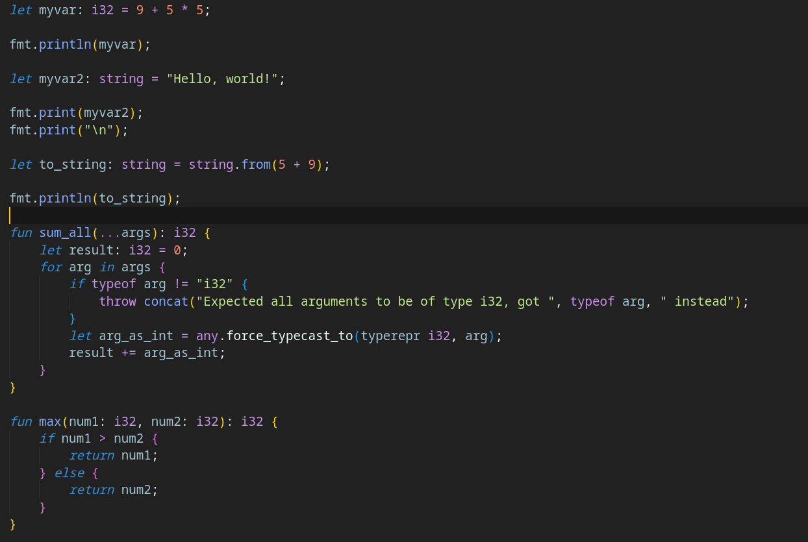

# QLang Virtual Machine documentation

## Getting started

Qlang has its own instruction set and assembly language. If you want to learn about how Qlang works, we recommend that you read this documentation.

Step 1. Install the latest Qlang binary from releases or build it from the source code
Step 2. Create a new .q file with the following lines:

```qasm
push string "Hello, world!\n"
putln
```

Step 3. Run `qlang build -i myfile.qasm -o output.q` to build your program
Step 4. Run `qlang run -i output.q` to run your Hello, world! program

## The Assembly Language

Technical information about Qlang's assembly language.

Types: None, class, int, bigint, float, lfloat, string, character, boolean, list, tuple, uninitialized, Error, ptrwrapper, any

Instructions: decl, readln, putln, fls, puterr, flserr, assgn, assgntop, throw, push, pop, ld, jmp, label, jmps, add, sub, mul, div, mod, pow, and, or, xor, not, eq, ne, gt, lt, gte, lte, cth, ecth, istd, incl, ivk, tastk, ret, getcp, ivkcm, setcp, chasp, chassm, hlt, fdef, fendef, dup, lnd, inln, dbgpstk, escp, lscp, clct, memrvol, memwvol, asrf, hrsm, rdil, topf, iinsof, gfnptr, ivptr, pfacptr, cst, grfh, cfh, pfhp, rffh, rfhts, rfhtb, wstfh, wbtfh

## How does Qlang work under the hood

### Stack

Qlang is a stack-based virtual machine, so most of the operations are made in the stack. For example, this is how you can add two numbers and print their sum:

```qasm
push int 3
push bigint 7
cst int
add
```

The code above pushes the integer 3 onto the stack, then it pushes the bigint 7 onto the stack, casts it to an integer and then adds them, which should result in an stack with the integer 10.

Qlang has two different stacks: The normal (data) stack and the arguments stack. Most of the operations can only be done in the data stack, but the arguments to a function have to be passed through a data stack. For example, if you wanted to concatenate two strings and one integer together, you would have to do this:

```qasm
istd
push string "Hello,"
push string " world!"
push int 3
tastk
tastk
tastk
ivk concat
```

In the above code, the standart library is included with the `istd` instruction, then the strings "Hello," and " world!" are pushed onto the stack, being followed by the integer 3.

The instruction `tastk` can be used to move the top value of the data stack to the argument stack. There is no reverse operation (to bring an argument from the argument stack to the data stack).

When a function is called, the length of the argument stack is checked against the length of the function's signature arguments. If they are different, an error is thrown. This is why the argument stack is not recommended to be used without this specific purpose.

When a built-in function is called, all of the values on the argument stack are collected and passed to the function, that then effectively checks their length.

### Function Calls

When a function is called in Qlang, the below actions occur:

* Qlang "sequestrates" the variable at the current scope
* The arguments passed are declared as local variables inside the function
* Qlang registers the called function name to the global variable _\_function__.

Some more things also occur, such as Qlang manipulating the instructions vector.

Another useful thing to know is that ultimately, after doing those 3 steps mentioned earlier, Qlang "expands" the functions' instructions in the current instructions at runtime.

So, for a instructions vector that contained:

```qasm
fdef f 1 arg1 int None
ld arg1
putln
ret
fendef

push int 3
tastk
ivk f
```

it would transform into:

```qasm
fdef f 1 arg1 int None
ld arg1
putln
ret
fendef

push int 3
tastk
ld arg1
putln
ret
```

effectively expanding the function's instructions.

## The Qo Programming Language

Qo is a simple programming language for the QVM that i'm currently making. Here is a screenshot of a file containing Qo code in VSCode (note that not every syntax in the file is currently valid):

